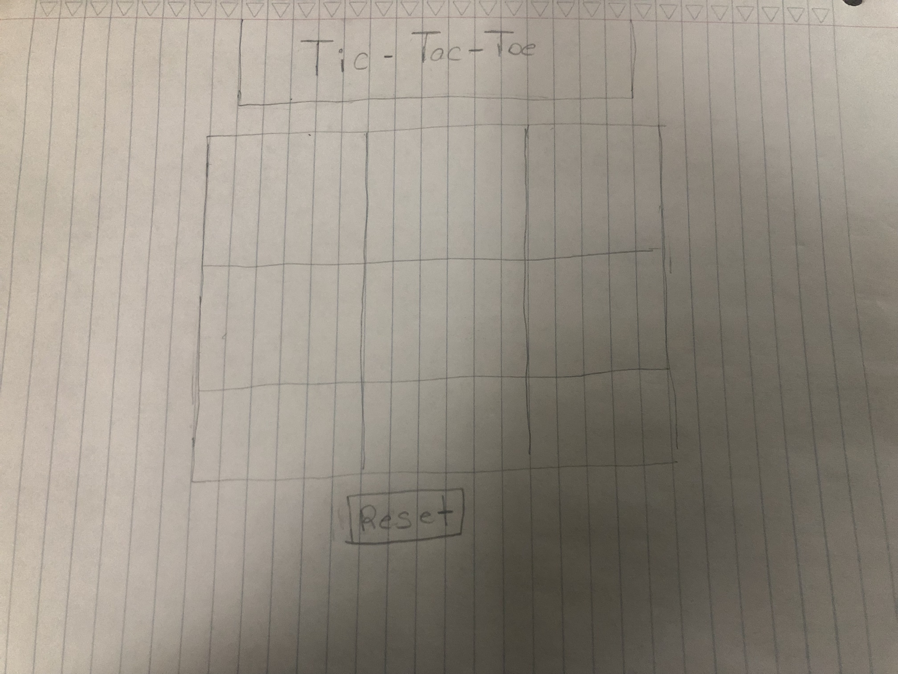

# Tic-Tac-Toe Project
Developer: Obinna Umerah
This website is to show my implementation of the Tic Tac Toe game.

### WireFrame

### Brief Demonstration
[Here is a link to the game](https://obinnaumerah.github.io/TicTacToe/)

### Technology Used
* Javascript
* CSS
* HTML

### User Stories
* As a user I can start a new tic tac toe game
* As a user I can click a square to add an X first and then O, and so on
* As a user I am shown a message after I win
* As a user I cannot click the same square twice
* As a user I am shown a message when I win, lose, or tie
* As a user I cannot keep playing when I win, lose, or tie
* As a user I can play the game again without refreshing the page

### Development Journey
In hindsight I wished that I planned the creation of this game a lot better. I subconsciously thought to myself that this wouldn't take much organization and planning and that ended up hurting me in the long run. There were a lot of things that I wanted to implement that I didn't get to implement.

### Credits
I wanted to give a lot of credits and gratitude to Jay Padilla, Lorena Rojas, and Jeff Ou for providing some helpful pointers. [This site also helped me to build my code as well](https://www.studytonight.com/post/building-a-tic-tac-toe-game-in-javascript) 

